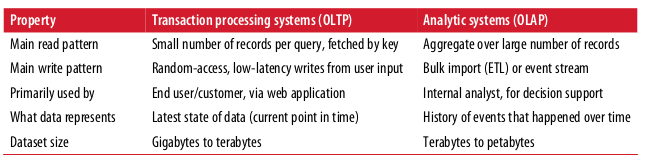
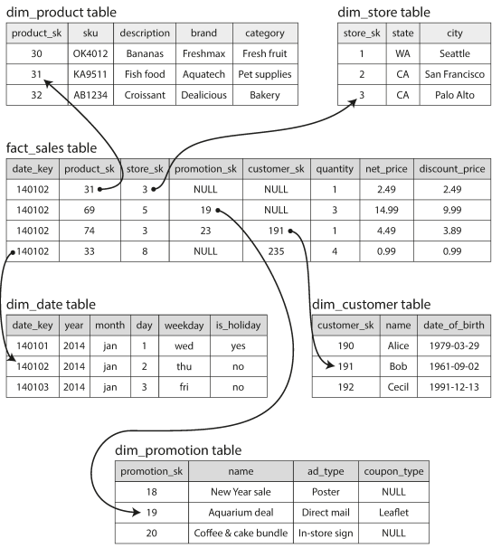
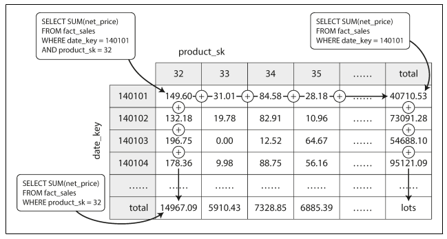

# system_design_interview_preparation
this is the third installment in the series of repos "interview preparation", this time I will use a group of question to make a summary of the book Designing Data-Intensive Applications

## Theorical Questions Section

### Theorical Question 1

Do you know what telemetry is ?

<b>Answer</b>

Getting clear monitoring, such as performance metrics and error rates. This is referred to as telemetry

<b>Source</b>

Designing Data-Intensive Applications - pag 10

### Theorical Question 2

Do you understand what a load parameter is (this question can be ambigious so, how do you know for example that you need to increase or decrease the resources of your system) ?

<b>Answer</b>

We need to succinctly describe the current load on the system; only then can we
discuss growth questions (what happens if our load doubles?). Load can be described
with a few numbers which we call load parameters. The best choice of parameters
depends on the architecture of your system: it may be requests per second to a web
server, the ratio of reads to writes in a database, the number of simultaneously active
users in a chat room, the hit rate on a cache, or something else. Perhaps the average
case is what matters for you, or perhaps your bottleneck is dominated by a small
number of extreme cases.

<b>Source</b>

Designing Data-Intensive Applications - pag 11

### Theorical Question 3

Do you understand what scaling up or vertical scaling and the difference with scaling out horizontal scaling?

<b>Answer</b>

scaling up (vertical scaling, moving to a
more powerful machine) and scaling out (horizontal scaling, distributing the load
across multiple smaller machines).

<b>Source</b>

Designing Data-Intensive Applications - pag 17

### Theorical Question 4

In computer science what is an abstraction.

<b>Answer</b>

One of the best tools we have for removing accidental complexity is abstraction. A
good abstraction can hide a great deal of implementation detail behind a clean,
simple-to-understand façade. A good abstraction can also be used for a wide range of
different applications.

<b>Source</b>

Designing Data-Intensive Applications - pag 21

### Theorical Question 5

Do you understand when is the best case for representing our data in JSON file and when should we use a database like mongoDB

<b>Answer</b>

For a data structure like a résumé, which is mostly a self-contained document, a JSON
representation can be quite appropriate: see Example 2-1. JSON has the appeal of
being much simpler than XML. Document-oriented databases like MongoDB [9],
RethinkDB [10], CouchDB [11], and Espresso [12] support this data model.

<b>Source</b>

Designing Data-Intensive Applications - pag 31

### Theorical Question 6

Do you understand what locallity is and why it helps databases like mongo achive higher performance than relational databases

<b>Answer</b>

The JSON representation has better locality than the multi-table schema. If you want to fetch a profile in the relational example, you need to either
perform multiple queries (query each table by user_id ) or perform a messy multi-
way join between the users table and its subordinate tables. In the JSON representa‐
tion, all the relevant information is in one place, and one query is sufficient.

<b>Source</b>

Designing Data-Intensive Applications - pag 33

### Theorical Question 7

Do you understand what normalization means

<b>Answer</b>

If that information is duplicated, all the redundant copies need to be
updated. That incurs write overheads, and risks inconsistencies (where some copies
of the information are updated but others aren’t). Removing such duplication is the
key idea behind normalization in databases. ii

<b>Source</b>

Designing Data-Intensive Applications - pag 33

### Theorical Question 8

when would you use a relational model instead of a nosql database ?

<b>Answer</b>

The main arguments in favor of the document data model are schema flexibility, bet‐
ter performance due to locality, and that for some applications it is closer to the data
structures used by the application. The relational model counters by providing better
support for joins, and many-to-one and many-to-many relationships.

<b>Source</b>

Designing Data-Intensive Applications - pag 38

### Theorical Question 9

Given the fact that we don't know when we will need to do a achnge in the schema, do you think that we will need a nosql database instead of a relationa one ?

<b>Answer</b>

Schema changes have a bad reputation of being slow and requiring downtime. This
reputation is not entirely deserved: most relational database systems execute the
ALTER TABLE statement in a few milliseconds. MySQL is a notable exception—it
copies the entire table on ALTER TABLE , which can mean minutes or even hours of
downtime when altering a large table.

Running the UPDATE statement on a large table is likely to be slow on any database,
since every row needs to be rewritten. If that is not acceptable, the application can
leave first_name set to its default of NULL and fill it in at read time, like it would with
a document database.

<b>Source</b>

Designing Data-Intensive Applications - pag 40

### Theorical Question 10

Do you understand the difference between declarative and imperating programming ?

<b>Answer</b>

An imperative language tells the computer to perform certain operations in a certain
order. You can imagine stepping through the code line by line, evaluating conditions,
updating variables, and deciding whether to go around the loop one more time.

In a declarative query language, like SQL or relational algebra, you just specify the
pattern of the data you want—what conditions the results must meet, and how you
want the data to be transformed (e.g., sorted, grouped, and aggregated)—but not how
to achieve that goal. It is up to the database system’s query optimizer to decide which
indexes and which join methods to use, and in which order to execute various parts
of the query.

<b>Source</b>

Designing Data-Intensive Applications - pag 43

### Theorical Question 11

Do you know what a pure function is ?

<b>Answer</b>

They must be pure functions, which means they only use the data that is passed to
them as input, they cannot perform additional database queries, and they must not
have any side effects. These restrictions allow the database to run the functions any‐
where, in any order, and rerun them on failure.

<b>Source</b>

Designing Data-Intensive Applications - pag 48

### Theorical Question 12

when would you use a grapgh like model ?

<b>Answer</b>

If your application has mostly one-to-many relationships (tree-structured data) or no relationships between records, the document
model is appropriate.

But what if many-to-many relationships are very common in your data? The relational model can handle simple cases of many-to-many relationships, but as the connections within your data become more complex, it becomes more natural to start modeling your data as a graph.

<b>Source</b>

Designing Data-Intensive Applications - pag 49

### Theorical Question 13

In databases what an Index is ?

<b>Answer</b>

In order to efficiently find the value for a particular key in the database, we need a
different data structure: an index. In this chapter we will look at a range of indexing
structures and see how they compare; the general idea behind them is to keep some
additional metadata on the side, which acts as a signpost and helps you to locate the
data you want. If you want to search the same data in several different ways, you may
need several different indexes on different parts of the data.

<b>Source</b>

Designing Data-Intensive Applications - pag 71

### Theorical Question 14

Do you know what hash indexes are ?

<b>Answer</b>

Key-value stores are quite similar to the dictionary type that you can find in most
programming languages, and which is usually implemented as a hash map Whenever you append a
new key-value pair to the file, you also update the hash map to reflect the offset of the
data you just wrote (this works both for inserting new keys and for updating existing
keys). When you want to look up a value, use the hash map to find the offset in the
data file, seek to that location, and read the value.

This may sound simplistic, but it is a viable approach. In fact, this is essentially what
Bitcask (the default storage engine in Riak) does [3]. Bitcask offers high-performance
reads and writes, subject to the requirement that all the keys fit in the available RAM,
since the hash map is kept completely in memory.

<b>Source</b>

Designing Data-Intensive Applications - pag 72

### Theorical Question 15

Do you know what a transactional database or OLTP is ?

<b>Answer</b>

Even though databases started being used for many different kinds of data—comments on blog posts, actions in a game, contacts in an address book, etc.—the basic
access pattern remained similar to processing business transactions. An application
typically looks up a small number of records by some key, using an index. Records
are inserted or updated based on the user’s input. Because these applications are
interactive, the access pattern became known as online transaction processing
(OLTP).

<b>Source</b>

Designing Data-Intensive Applications - pag 92

### Theorical Question 16

Do you know what a analitical database or OLAP is ?

<b>Answer</b>

databases also started being increasingly used for data analytics, which has
very different access patterns. Usually an analytic query needs to scan over a huge
number of records, only reading a few columns per record, and calculates aggregate
statistics (such as count, sum, or average) rather than returning the raw data to the
user. For example, if your data is a table of sales transactions, then analytic queries
might be:
• What was the total revenue of each of our stores in January?
• How many more bananas than usual did we sell during our latest promotion?
• Which brand of baby food is most often purchased together with brand X
diapers?

These queries are often written by business analysts, and feed into reports that help
the management of a company make better decisions (business intelligence). In order
to differentiate this pattern of using databases from transaction processing, it has
been called online analytic processing (OLAP)

<b>Source</b>

Designing Data-Intensive Applications - pag 92

### Theorical Question 17

Do you know the difference between OLAP and OLTP ?

<b>Answer</b>

<b>Source</b>

Designing Data-Intensive Applications - pag 91

### Theorical Question 18

Do you know the star-schema is ?

<b>Answer</b>

Many data warehouses are used in a fairly formulaic style, known as a star schema (also known as dimensional modeling [55]).

The example schema the Figure below shows a data warehouse that might be found at a
grocery retailer. At the center of the schema is a so-called fact table (in this example,
it is called fact_sales ). Each row of the fact table represents an event that occurred
at a particular time (here, each row represents a customer’s purchase of a product). If
we were analyzing website traffic rather than retail sales, each row might represent a
page view or a click by a user.

A variation of this template is known as the snowflake schema, where dimensions are
further broken down into subdimensions. For example, there could be separate tables
for brands and product categories, and each row in the dim_product table could ref‐
erence the brand and category as foreign keys, rather than storing them as strings in
the dim_product table.

<b>Source</b>

Designing Data-Intensive Applications - pag 91

### Theorical Question 16

In Columnar storage, do you know what is the benefit of columnar compression ?

<b>Answer</b>

Besides only loading those columns from disk that are required for a query, we can
further reduce the demands on disk throughput by compressing data. Fortunately,
column-oriented storage often lends itself very well to compression.

<b>Source</b>

Designing Data-Intensive Applications - pag 100

### Theorical Question 17

Do you know what a secondary index is ?

<b>Answer</b>

Different queries benefit from different sort
orders, so why not store the same data sorted in several different ways? Data needs to
be replicated to multiple machines anyway, so that you don’t lose data if one machine
fails. You might as well store that redundant data sorted in different ways so that
when you’re processing a query, you can use the version that best fits the query
pattern.

Having multiple sort orders in a column-oriented store is a bit similar to having mul‐
tiple secondary indexes in a row-oriented store. But the big difference is that the row-
oriented store keeps every row in one place (in the heap file or a clustered index), and
secondary indexes just contain pointers to the matching rows.

<b>Source</b>

Designing Data-Intensive Applications - pag 100

### Theorical Question 18

Do you understand what a materialized view is ?

<b>Answer</b>

data warehouse queries often involve an aggregate
function, such as COUNT , SUM , AVG , MIN , or MAX in SQL. If the same aggregates are used
by many different queries, it can be wasteful to crunch through the raw data every
time. Why not cache some of the counts or sums that queries use most often?

One way of creating such a cache is a materialized view. In a relational data model, it
is often defined like a standard (virtual) view: a table-like object whose contents are
the results of some query. The difference is that a materialized view is an actual copy
of the query results, written to disk, whereas a virtual view is just a shortcut for writ‐
ing queries. When you read from a virtual view, the SQL engine expands it into the
view’s underlying query on the fly and then processes the expanded query.
When the underlying data changes, a materialized view needs to be updated, because
it is a denormalized copy of the data.

<b>Source</b>

Designing Data-Intensive Applications - pag 100

### Theorical Question 19

Do you understand what a data cube or OLAP cube is ?

<b>Answer</b>

A common special case of a materialized view is known as a data cube or OLAP cube. It is a grid of aggregates grouped by different dimensions.

You can now draw a two-dimensional table,
with dates along one axis and products along the other. Each cell contains the aggre‐
gate (e.g., SUM ) of an attribute (e.g., net_price ) of all facts with that date-product
combination. Then you can apply the same aggregate along each row or column and
get a summary that has been reduced by one dimension (the sales by product regard‐
less of date, or the sales by date regardless of product).

The advantage of a materialized data cube is that certain queries become very fast
because they have effectively been precomputed. For example, if you want to know the total sales per store yesterday, you just need to look at the totals along the appropriate dimension—no need to scan millions of rows.

The disadvantage is that a data cube doesn’t have the same flexibility as querying the
raw data. For example, there is no way of calculating which proportion of sales comes
from items that cost more than $100, because the price isn’t one of the dimensions.
Most data warehouses therefore try to keep as much raw data as possible, and use
aggregates such as data cubes only as a performance boost for certain queries.

<b>Source</b>

Designing Data-Intensive Applications - pag 100

### Theorical Question 20

Do you understand why do we need to encode and decode (also know serialize and de-serialize) ?

<b>Answer</b>

because data in different context is stored in different formants for example:

1. In memory, data is kept in objects, structs, lists, arrays, hash tables, trees, and so
on. These data structures are optimized for efficient access and manipulation by
the CPU (typically using pointers).

2. When you want to write data to a file or send it over the network, you have to
encode it as some kind of self-contained sequence of bytes (for example, a JSON
document). Since a pointer wouldn’t make sense to any other process, this sequence-of-bytes representation looks quite different from the data structures
that are normally used in memory

<b>Source</b>

Designing Data-Intensive Applications - pag 112

### Theorical Question 21

Do you know any python library for encoding and decoding (also known as serialize and deserialize) ?

<b>Answer</b>

pickle

<b>Source</b>

Designing Data-Intensive Applications - pag 112

### Theorical Question 22

Do you understand what schema evolution is and how do apache Thrift and Protocol Buffers handle it ?

<b>Answer</b>

You can add new fields to the schema, provided that you give each field a new tag
number. If old code (which doesn’t know about the new tag numbers you added)
tries to read data written by new code, including a new field with a tag number it
doesn’t recognize, it can simply ignore that field. The datatype annotation allows the
parser to determine how many bytes it needs to skip. This maintains forward com‐
patibility: old code can read records that were written by new code.

What about backward compatibility? As long as each field has a unique tag number,
new code can always read old data, because the tag numbers still have the same
meaning. The only detail is that if you add a new field, you cannot make it required.
If you were to add a field and make it required, that check would fail if new code read
data written by old code, because the old code will not have written the new field that
you added. Therefore, to maintain backward compatibility, every field you add after
the initial deployment of the schema must be optional or have a default value.

What about changing the datatype of a field? That may be possible—check the docu‐
mentation for details—but there is a risk that values will lose precision or get trunca‐
ted. For example, say you change a 32-bit integer into a 64-bit integer. New code can
easily read data written by old code, because the parser can fill in any missing bits
with zeros. However, if old code reads data written by new code, the old code is still
using a 32-bit variable to hold the value. If the decoded 64-bit value won’t fit in 32
bits, it will be truncated.

<b>Source</b>

Designing Data-Intensive Applications - pag 120

### Theorical Question 23

Do you know what REST is ?

<b>Answer</b>

REST is not a protocol, but rather a design philosophy that builds upon the principles
of HTTP [34, 35]. It emphasizes simple data formats, using URLs for identifying
resources and using HTTP features for cache control, authentication, and content
type negotiation.

<b>Source</b>

Designing Data-Intensive Applications - pag 133

### Theorical Question 23

Do you know what REST is ?

<b>Answer</b>

REST is a design philosophy that builds upon the principles
of HTTP . It emphasizes simple data formats, using URLs for identifying
resources and using HTTP features for cache control, authentication, and content
type negotiation.

<b>Source</b>

Designing Data-Intensive Applications - pag 133

### Theorical Question 24

Do you know what SOAP is ?

<b>Answer</b>

SOAP is an XML-based protocol for making network API requests. vii
Although it is most commonly used over HTTP, it aims to be independent from
HTTP and avoids using most HTTP features. Instead, it comes with a sprawling and
complex multitude of related standards (the web service framework, known as WS-*)

<b>Source</b>

Designing Data-Intensive Applications - pag 133

### Theorical Question 25

Do you know what swagger can do for your RESTful api ?

<b>Answer</b>

describe it and produce documentation.

<b>Source</b>

Designing Data-Intensive Applications - pag 133

### Theorical Question 26

Do you understand what futures, promises and streams are ?

<b>Answer</b>

Futures and promises are the same. Futures encapsulate asynchronous actions that may fail. Futures also
simplify situations where you need to make requests to multiple services in parallel,
and combine their results. In streams call consists of not
just one request and one response, but a series of requests and responses over time.

<b>Source</b>

Designing Data-Intensive Applications - pag 133

### Theorical Question 27

Do you understand why would we use a message broker (also known as message queue or message-oriented middleware) ?

<b>Answer</b>

• It can act as a buffer if the recipient is unavailable or overloaded, and thus
improve system reliability.
• It can automatically redeliver messages to a process that has crashed, and thus
prevent messages from being lost.
• It avoids the sender needing to know the IP address and port number of the
recipient (which is particularly useful in a cloud deployment where virtual
machines often come and go).
• It allows one message to be sent to several recipients.
• It logically decouples the sender from the recipient (the sender just publishes
messages and doesn’t care who consumes them).

<b>Source</b>

Designing Data-Intensive Applications - pag 137

### Theorical Question 27

Do you undestand what share-memory architecture,  share nothing architecture what horizontal scaling or
scaling out is and what vertical scaling or scaling up?

<b>Answer</b>

Shared-memory architecture is basically building a more powerfull machine, if you need more resources, you need an even more powerful machine, replacing this machine for a more powerfull one is what we call vertical

In a shared-memory architecture you have several machines working in a single mission, if you want more resources, you increase the number of servers, this is what we call jorizontal scaling or scaling out.

The problem with a shared-memory approach is that the cost grows faster than line‐
arly: a machine with twice as many CPUs, twice as much RAM, and twice as much
disk capacity as another typically costs significantly more than twice as much. And
due to bottlenecks, a machine twice the size cannot necessarily handle twice the load.

<b>Source</b>

Designing Data-Intensive Applications - pag 146

### Theorical Question 28

Do you understand what a failover is ?

<b>Answer</b>

Handling a failure of the leader is trickier: one of the followers needs to be promoted
to be the new leader, clients need to be reconfigured to send their writes to the new
leader, and the other followers need to start consuming data changes from the new
leader. This process is called failover.

<b>Source</b>

Designing Data-Intensive Applications - pag 157

### Theorical Question 29

How do you know that the leader (or master node) has crashed ?

<b>Answer</b>

With a timeout

<b>Source</b>

Designing Data-Intensive Applications - pag 157

### Theorical Question 30

Do you understand what replication lag is and how it affect  ?

<b>Answer</b>

Leader-based replication requires all writes to go through a single node, but read-
only queries can go to any replica. For workloads that consist of mostly reads and
only a small percentage of writes (a common pattern on the web), there is an attrac‐
tive option: create many followers, and distribute the read requests across those fol‐
lowers. This removes load from the leader and allows read requests to be served by
nearby replicas.

In this read-scaling architecture, you can increase the capacity for serving read-only
requests simply by adding more followers. However, this approach only realistically
works with asynchronous replication—if you tried to synchronously replicate to all
followers, a single node failure or network outage would make the entire system unavailable for writing. And the more nodes you have, the likelier it is that one will
be down, so a fully synchronous configuration would be very unreliable.

Unfortunately, if an application reads from an asynchronous follower, it may see out‐
dated information if the follower has fallen behind.

This inconsistency is just a temporary state—if you stop writing to the
database and wait a while, the followers will eventually catch up and become consis‐
tent with the leader. For that reason, this effect is known as eventual consistency

<b>Source</b>

Designing Data-Intensive Applications - pag 157

### Theorical Question 31

Do you understand what "read your own writte" is refering to ?

<b>Answer</b>

If the user views the data shortly after making a write, the new data may not yet have
reached the replica. To the user, it looks as though the data they submitted was lost,
so they will be understandably unhappy.

<b>Source</b>

Designing Data-Intensive Applications - pag 157

### Theorical Question 32

Do you know what monotonic reads are ?

<b>Answer</b>

Our second example of an anomaly that can occur when reading from asynchronous
followers is that it’s possible for a user to see things moving backward in time.
This can happen if a user makes several reads from different replicas.

Monotonic reads is a guarantee that this kind of anomaly does not happen. It’s a
lesser guarantee than strong consistency, but a stronger guarantee than eventual con‐
sistency. When you read data, you may see an old value; monotonic reads only means
that if one user makes several reads in sequence, they will not see time go backward—
i.e., they will not read older data after having previously read newer data.
One way of achieving monotonic reads is to make sure that each user always makes
their reads from the same replica (different users can read from different replicas).
For example, the replica can be chosen based on a hash of the user ID, rather than
randomly. However, if that replica fails, the user’s queries will need to be rerouted to
another replica.

<b>Source</b>

Designing Data-Intensive Applications - pag 157

